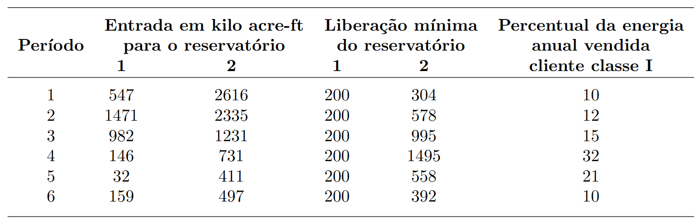
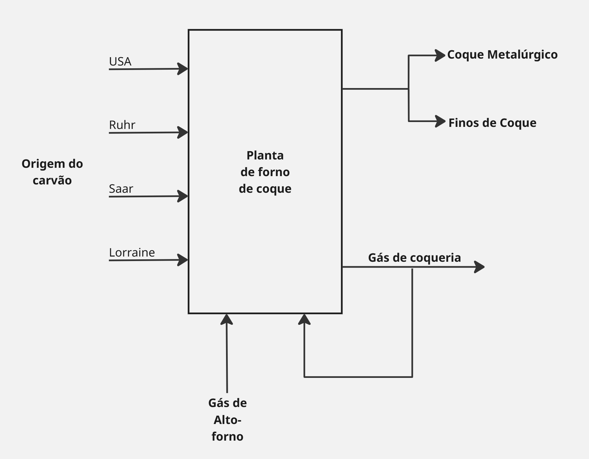
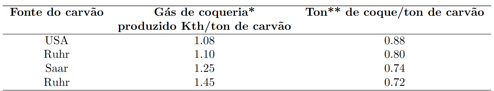
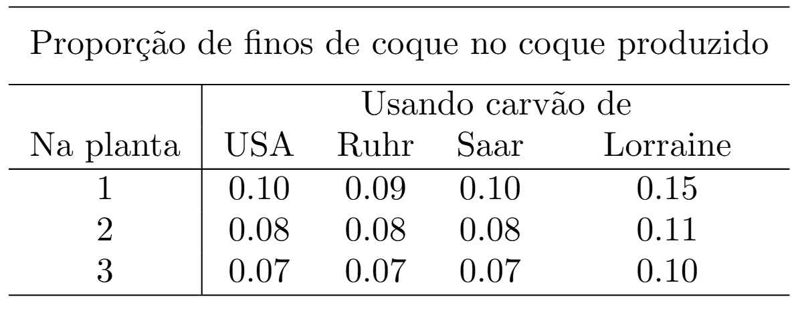
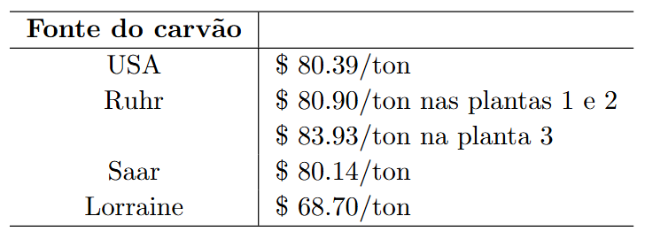
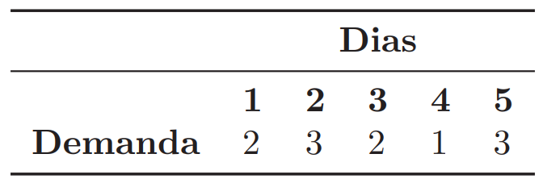
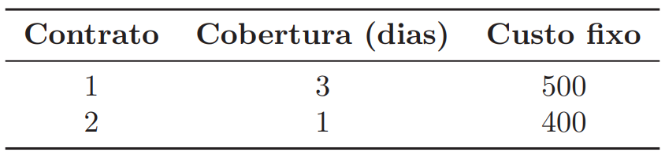

---
output:
  pdf_document: default
  html_document: default
---

# Exercícios {.unnumbered}

## 1 Modelagem{-}

------------------------------------------------------------------------

### Exercício 1 {.unnumbered}

**(<em>Katta Murty 1.26</em>)** Uma agência controla a operação de um sistema que consiste em dois reservatórios de água com uma usina hidrelétrica acoplada a cada um. O horizonte de planejamento para o sistema é de um ano, dividido em seis períodos. O reservatório 1 tem capacidade para armazenar 3500 kilo acres-pés de água e o reservatório 2 tem capacidade para 5500 kilo acres-pés. Em qualquer instante de tempo, se o reservatório estiver em sua capacidade máxima, a água adicional que entrar será descartada por meio de um vertedouro. A água descartada não produz eletricidade.

Durante cada período, uma quantidade mínima especificada de água deve ser liberada dos reservatórios para atender às necessidades a jusante de recreação, irrigação e navegação. Entretanto, não há limite superior para a quantidade de água que pode ser liberada dos reservatórios. Qualquer água não liberada é armazenada (até a capacidade do reservatório) e pode ser utilizada para liberação em períodos subsequentes. Toda a água liberada dos reservatórios (mesmo que seja liberada para recreação e outros propósitos) produz eletricidade.

Pode-se assumir que, durante cada período, as entradas e liberações de água ocorrem a uma taxa constante. Além disso, em média, 1 acre-pé de água liberada do reservatório 1 produz 310 kWh de eletricidade, e 1 acre-pé liberado do reservatório 2 produz 420 kWh.

No início do ano, o reservatório 1 contém 1800 kilo acres-pés de água e o reservatório 2 contém 2500 kilo acres-pés de água. As mesmas quantidades de água devem permanecer nos respectivos reservatórios no final do ano.

A eletricidade produzida pode ser vendida a um consumidor local (chamado de cliente classe I) ou a clientes classe II.

Um cliente classe I compra eletricidade com base anual; ele exige que porcentagens especificadas dela sejam fornecidas em vários períodos. Ele paga \$10,00/1000 kWh.

Um cliente classe II compra eletricidade período a período. Ele comprará qualquer quantidade de eletricidade em qualquer período a \$5,00/1000 kWh.

Os dados do problema são apresentados a seguir.

 

Opere o sistema para maximizar o lucro anual total da venda de eletricidade.

------------------------------------------------------------------------

### Exercício 2 {.unnumbered}

**(<em>Katta Murty 1.23</em>)** Uma empresa europeia possui três plantas de coquerias (fornos de coque), codificadas como 1, 2 e 3. O carvão vem de quatro fontes diferentes: EUA, Ruhr, Lorena e Sarre. As plantas produzem coque, que pode ser classificado em duas categorias: coque metalúrgico, que é o mais valorizado e usado na produção de aço e os chamados “finos de coque”, que são pedaços pequenos ou pó resultante do processo; elas também produzem gás de forno de coque.

As plantas de coquerias são operadas aquecendo-as com gás de alto-forno ou gás de coqueria. O fluxograma do processo é apresentado na figura a seguir. A produção de gás de coqueria e de coque depende do carvão utilizado.

 

 

<em>***A quantidade de gás de forno de coque produzida é medida pelo seu conteúdo energético. <em>Kth</em> é uma <em>kilothermie</em>, onde thermie é a quantidade de calor necessária para elevar a temperatura de 1 tonelada de água em 1 grau Celsius.**  <b>**Tonelada</b></em>

A proporção de finos de coque no coque produzido depende do carvão usado e da planta onde ele é utilizado.

  

O coque metalúrgico é o que sobra no coque após a separação dos finos de coque.

Processar uma tonelada de carvão requer o equivalente energético a 0,611 <em>Kth</em> de gás de forno de coque. Uma unidade de gás de alto-forno equivale a 0,927 <em>Kth</em> de gás de forno de coque.

As capacidades anuais de processamento das três plantas são de 9 × 10<small>5</small> tonelada,  7 × 10<small>5</small> toneladas e 3 × 10<small>5</small> toneladas de carvão, respectivamente.

O carvão de Saar não pode ser usado nas plantas 1 e 2. O carvão dos USA e Lorraine não podem ser usados na planta 3. A porcentagem do carvão de Lorraine usado na planta 1 não pode exceder 30. A porcentagem do carvão de Lorraine usado na planta 2 não pode exceder 35. A porcentagem do carvão de Saar usado na planta 3 não pode exceder 40.

Gás de coqueria pode ser comprado ou vendido  em qualquer quantidade por \$11/<em>Kth</em>. Finos de coque podem ser vendidos em qualquer quantidade  por \$98/tonelada. Gás de alto-forno pode ser comprado em qualquer quantidade por \$8/unit. O preços dos carvões são apresentados a seguir:

  

Todo o fino de coque produzido é vendido. Todo o gás de coqueria produzido é utilizado nas plantas ou vendido.

É necessário produzir um total de 10<small>6</small> toneladas de coque metalúrgico ao final do ano.

---

### Exercício 3 (Modelagem Inteira){-}

**(<em>Caso BRF</em>)** Uma empresa alimentícia aluga veículos para realizar as suas entregas. O setor de PCP junto ao departamento de logística faz o dimensionamento de toda carga que deve ser alocada a cada veículo, bem como a sua rota. Dessa forma, sabe-se, para cada dia de um horizonte de planejamento, quantos veículos serão necessesários. Esse dado é mostrado pela Tabela a seguir:

  

Cada contrato por um veículo permite que o mesmo seja utilizado por uma quantidade limitada de dias no horizonte de planejamento, e existe um custo associado ao contrato. O custo do contrato independe do número de dias que o veículo é alocado pela empresa. A próxima tabela mostra os tipos de contrato existentes:

  

a\) Determine o modelo de PI para o problema de contratação e alocação de frota da BRF. 
b\) Escreva o modelo genérico (conjuntos, parâmetros, variáveis) para o problema.

---

### Exercício 4 (Modelagem Inteira){-}

**(<em>Caso Ek. simplificado</em>)** Uma empresa precisa determinar as configurações da sua malha logística a longo prazo. A malha funciona da seguinte forma: existe um conjunto de fornecedores capazes de entregar diferentes produtos em diferentes de tempo. Os produtos podem ser entregues diretamente aos clientes, ou deixados em depósitos  e posteriormente enviados aos clientes (havendo assim uma consolidação de carga). Os clinetes possuem uma demanda dos diferentes produtos a cada período. Os depósitos possuem capacidades volumétricas/período e custos  fixos de abertura, se forem utilizados. Existe um custo por volume transportado associado a cada par de nós da rede (fornecedor-depósito),(fornecedor-cliente),(depósito-cliente). A malha logística pode ser simplificada pelo diagrama abaixo. 

  

Considerando a malha exemplo da Figura, um horizonte de planejamento de 4 períodos, 2 produtos, e as informações abaixo, crie o modelo de programação inteira para o caso da empresa.

botar as tabelas

---

## 2 Introdução a Python{-}

---

### Exercício 1{-}
